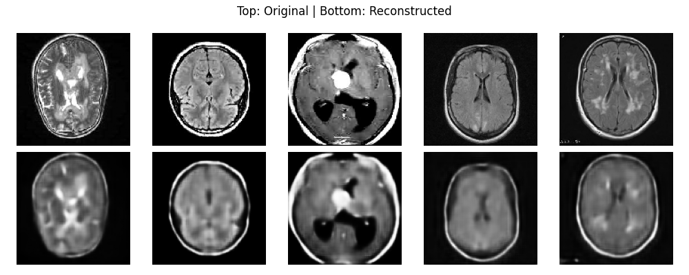
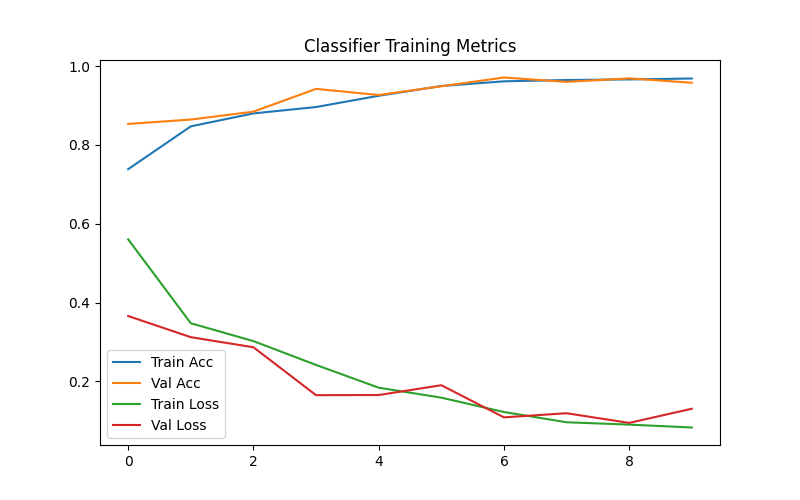
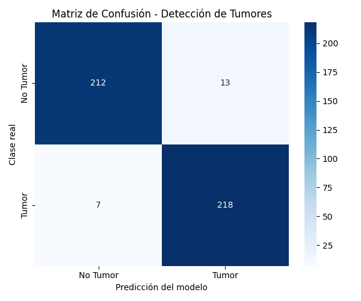

# Brain Tumor Detection with Deep Learning

Personal computer vision project that classifies brain MRI scans as tumor / no tumor, and explains its predictions with Grad-CAM heatmaps.

The whole pipeline lives in a single script, `Tumor_detector.py`, and runs in four phases:

1. **Data download and preparation**
   - Downloads the public [Br35H :: Brain Tumor Detection 2020](https://www.kaggle.com/datasets/ahmedhamada0/brain-tumor-detection) dataset from Kaggle with `kagglehub`. Images come sorted into `yes` (tumor) and `no` (no tumor) folders.
   - Splits the data into train / validation / test (70% / 15% / 15%).
   - Applies data augmentation to the training set (rotation, zoom, horizontal flip) and converts images to 128x128 grayscale.

2. **Autoencoder**
   - A convolutional autoencoder compresses each image into a smaller latent representation and reconstructs it, forcing the model to learn the important patterns in the scans.
   - Reconstruction samples are saved so you can visually check what the model learned.

   

3. **Classifier**
   - The encoder half of the autoencoder is extracted and its latent space feeds a binary classifier (dense layers with dropout and batch normalization).
   - Evaluation on the test set produces a confusion matrix and a classification report (precision, recall, F1), saved to `results/evaluation_report.txt`.

   

   

4. **Interpretability with Grad-CAM**
   - Grad-CAM heatmaps are generated over the encoder's last convolutional layer and overlaid on the original scans, showing which regions drove the decision. Examples are saved separately for tumor and no-tumor cases.

   

The repo includes sample outputs from a real run: reconstructions, autoencoder loss, classifier metrics history, a confusion matrix and Grad-CAM overlays.

## Requirements

Python with TensorFlow/Keras, scikit-learn, OpenCV, Matplotlib and `kagglehub`.

## How to run

```bash
pip install tensorflow scikit-learn opencv-python matplotlib kagglehub
python Tumor_detector.py
```

Note: the `BASE_DIR` constant at the top of the script points to a local path on the author's machine; change it to your own working directory before running.

## Disclaimer

This is an educational project. It is not a medical device and must not be used for diagnosis.
